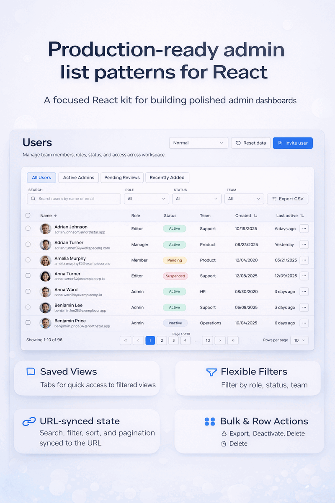

# react-admin-list-kit

<p align="center">
  
</p>

<p align="center">
  <strong>Production-ready admin list patterns for React</strong>
</p>

<p align="center">
  
  
  
  
  
</p>

`react-admin-list-kit` is a focused React toolkit and reference implementation for building production-style admin list screens.

It is designed for teams that want more than a raw table engine, but do not want to commit to a full admin framework. The project packages the patterns that are repeatedly rebuilt in internal tools, backoffice systems, and SaaS admin panels.

This repository is intentionally practical: it includes a realistic demo, a local fake API layer, and a clean starting point for extending the current implementation with additional list workflows and backend integrations.

## Why

Most table libraries solve rendering and core mechanics, but real admin screens usually need a broader set of coordinated behaviors:

- search, filters, sorting, and pagination working together
- row selection and bulk actions
- URL-synced state for shareable views
- saved views for repeated workflows
- stable loading, empty, and error states
- realistic export and row action patterns
- a structure that can later connect to a real backend

That gap between low-level table tooling and large admin frameworks is the reason this project exists.

## Current Scope

At the moment, the repository focuses on a single polished **Users** management demo.

The goal is not to pretend that this is a finished all-in-one solution. The goal is to provide a strong, realistic reference implementation that can grow over time.

The current codebase is meant to be:

- useful as a real demo
- understandable for other developers
- practical to extend
- open to iteration based on feedback and new use cases

## Features

### Available today

- **Users management demo**
  - realistic admin list screen with production-style workflows

- **Local mock API**
  - local-first data layer
  - simulated latency
  - simulated empty state
  - simulated error state
  - API-ready query shape for later backend replacement

- **Search**
  - search by name and email

- **Filters**
  - role
  - status
  - team

- **Sorting**
  - name
  - created date
  - last active

- **Pagination**
  - page controls
  - page-size selector
  - URL-synced page state

- **Row selection**
  - single row selection
  - select all visible rows

- **Bulk actions**
  - export selected
  - deactivate selected
  - delete selected

- **Saved views**
  - All users
  - Active admins
  - Pending reviews
  - Recently added

- **URL-synced list state**
  - search query
  - filters
  - sort state
  - page
  - page size

- **Column visibility**
  - configurable visible columns for the table

- **Row actions**
  - view
  - edit
  - activate / deactivate (status-aware)
  - delete

- **Table states**
  - loading
  - empty
  - error

- **CSV export**
  - filtered rows
  - selected rows

- **Avatar support**
  - local fictional avatar assets
  - initials fallback if an avatar is missing

- **Sticky header option**
  - optional sticky table header in the demo

### Planned

- API adapters for real backends
- optional React Query integration
- persisted saved views per user or workspace
- more advanced filtering options
- additional demos such as Orders, Payments, and Audit Logs
- packaging improvements for easier reuse of the list layer

## Demo Overview

The included demo is a polished **Users** screen built around realistic list workflows:

- saved views
- URL-synced state
- row actions
- bulk actions
- column visibility
- table state handling
- export flows

All behavior runs through a local fake API that mirrors real server query shape, so moving to a backend-backed implementation later is straightforward.

## Tech Stack

- React 19
- TypeScript
- Vite
- Tailwind CSS
- TanStack Table
- React Router for URL-synced state

## Getting Started

### Install dependencies

```bash
npm install
```

### Start the development server

```bash
npm run dev
```

Open the local URL printed by Vite, usually:

```txt
http://localhost:5173
```

### Build for production

```bash
npm run build
npm run preview
```

### Optional verification

```bash
npm run lint
npm run typecheck
```

## Project Structure

```text
src/
  app/                     # App shell
  components/ui/           # Shared UI primitives
  features/user-list/      # User Management feature
  data/mock/               # Seed data and fake API layer
  types/                   # Shared TypeScript contracts
  utils/                   # CSV, date, and utility helpers
public/
  avatars/                 # Local fictional avatar assets
```

## What This Repository Is

- a practical reference for building admin lists in product teams
- a local-first demo with an API-ready boundary
- a base for adding real adapters and additional admin screens
- a focused project around list workflows rather than a generic showcase

## What This Repository Is Not

- a full admin framework
- a backend service
- a complete product
- a finished end-state with every list use case already implemented

## Roadmap

Planned directions include:

- extracting more reusable list primitives from the current implementation
- adding API adapters for real backends
- optional React Query integration
- persisted saved views per user or workspace
- more advanced filtering options
- additional demos such as Orders, Payments, and Audit Logs
- packaging improvements for easier reuse of the list layer

## Contributions and Feedback

This project is not meant to be treated as “done”.

It is intentionally open for improvement, iteration, and expansion. Feedback, suggestions, issues, and practical ideas for additional list patterns are welcome.

Useful contributions could include:

- better list ergonomics
- additional admin demos
- more reusable abstractions
- adapter examples for real APIs
- improvements to filtering, export, or saved view flows
- UI refinements that preserve the project’s current direction

If you have ideas, edge cases, or patterns you think belong here, feel free to open an issue or start a discussion.

## Author

**Benjamin Flassig**  
**GitHub:** https://github.com/BFlassig

## License

MIT
